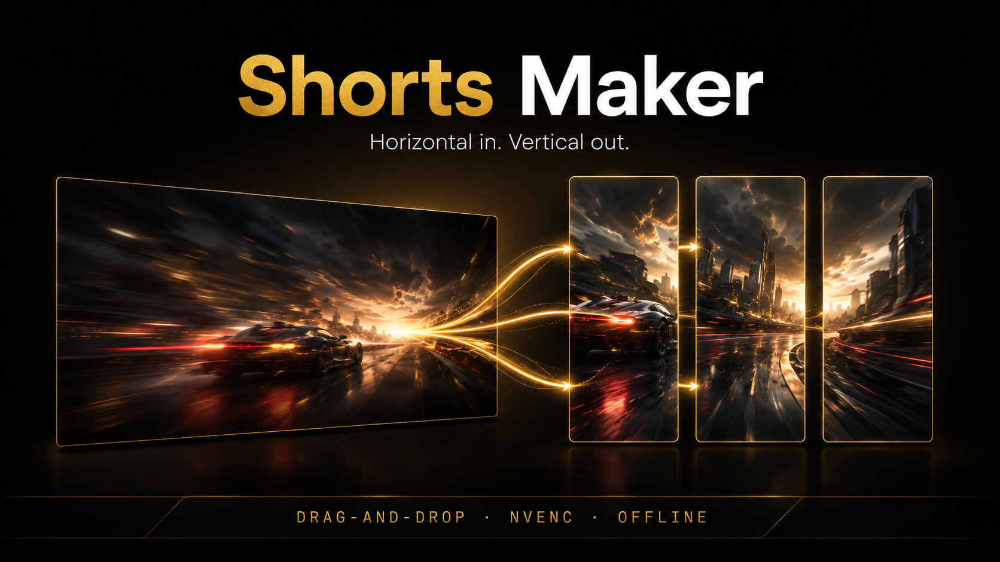

# Aragon Cuts

Convert horizontal videos to vertical 9:16 clips for YouTube Shorts, TikTok,
Instagram Reels, and Twitch. Drop a video, set IN/OUT, click encode.



## Features

- **Drag-and-drop** any common video format (mp4, mov, mkv, avi, webm, m4v)
- **Visual timeline** with a thumbnail strip, draggable IN / OUT handles,
  mark buttons, and keyboard hotkeys (`Space`, `I`, `O`, `L`, arrows)
- **Loop preview** — play between IN and OUT on repeat (press `L`) to verify
  the clip before queuing
- **Multi-clip queue** — turn a single source into multiple shorts in one
  pass, with a clear-queue button and per-clip progress
- **Live encode progress** — percent, realtime speed, and ETA per clip
- **Blurred-background fill** keeps the original frame visible while filling
  the 9:16 canvas
- **Channel-name watermark** centered above the video, with four visual
  styles (Boxed, Minimal, Gold pill, Outline)
- **Hook text** — large gold headline in the bottom area for the first
  1–5 seconds of every clip, with smooth fade in/out
- **Hardware-accelerated** encoding via NVENC on NVIDIA GPUs, automatic
  fallback to libx264 on AMD / Intel / no-GPU machines
- **Audio copied unchanged** from the source (no quality loss on the audio
  track)
- **Offline** — no telemetry, no auth, no cloud, no internet required after
  install

## Install (end users)

Download the latest Windows installer from the
[**Releases**](../../releases) page:

- `Aragon Cuts_<version>_x64-setup.exe` (recommended, ~250 MB)

The installer is fully self-contained — Webview2 runtime and FFmpeg are
bundled inside, so installation works on an offline machine.

### Requirements

- Windows 10 or 11 (64-bit)
- 8 GB RAM
- ~500 MB free disk space
- No internet required for install or use

### Optional: GPU acceleration

- **NVIDIA GPU** (GTX 1050 or newer) — uses NVENC, ~10× faster encoding
- **AMD / Intel / no GPU** — falls back to CPU (libx264), works fine, slower
- The app auto-detects on launch; no manual setup

## How to use

1. **Drop a video** onto the window (or click **Open**). A thumbnail strip
   appears under the timeline a couple of seconds later.
2. **Choose your clip:**
   - Drag the green **I** / red **O** handles on the timeline, OR
   - Press <kbd>Space</kbd> to play, then <kbd>I</kbd> / <kbd>O</kbd> at
     the playhead position, OR
   - Click the **IN** / **OUT** buttons in the playback bar
   - <kbd>←</kbd> / <kbd>→</kbd> step one frame, <kbd>Shift</kbd>+arrows
     step one second
   - Press <kbd>L</kbd> (or click the loop button) to play between IN and
     OUT on repeat
3. **Click "Add current IN/OUT"** to queue the clip
4. Repeat 2–3 for as many clips as you want from the same source
5. *(Optional)* Add a **channel name** (top centered watermark) and pick a
   style — Boxed, Minimal, Gold pill, or Outline
6. *(Optional)* Add **hook text** with a duration — gold headline that
   appears at the bottom for the first 1–5 seconds of every clip
7. **Click ENCODE** — outputs land in a dedicated `<source_name>_shorts/`
   folder beside the source video. The queue shows live progress, speed
   and ETA per clip.

## Output format

| Property        | Value                              |
| --------------- | ---------------------------------- |
| Resolution      | 1080 × 1920 (9:16 vertical)        |
| Framerate       | Same as source                     |
| Video codec     | H.264 (NVENC or libx264)           |
| Quality         | CQ 20 (high)                       |
| Audio           | Stream-copied from source          |
| Container       | MP4 with `+faststart`              |
| Naming          | `clip_<inSec>-<outSec>s.mp4`       |

## Build from source

Requires **Node 20+**, **pnpm 9+**, **Rust stable**.

```powershell
git clone https://github.com/aragonaragon/aragon-cuts.git
cd aragon-cuts
pnpm install

# One-time: download FFmpeg sidecars (~100 MB)
pwsh scripts/setup-ffmpeg.ps1

# Dev (hot-reload)
pnpm tauri dev

# Production installer (writes to src-tauri/target/release/bundle/)
pnpm tauri build
```

The build produces both NSIS (`.exe`) and WiX (`.msi`) installers under
`src-tauri/target/release/bundle/`. The NSIS one is recommended.

## Project structure

```
aragon-cuts/
├── src/                    # React frontend (TypeScript)
│   ├── App.tsx             # Main app state + drag-drop + queue
│   ├── components/         # UI components
│   ├── lib/                # Pure utilities (time formatting, etc.)
│   └── types/              # Shared TypeScript types
├── src-tauri/              # Rust backend
│   ├── src/
│   │   ├── lib.rs          # Plugin registration
│   │   └── commands/       # Tauri command handlers
│   │       ├── ffprobe.rs  # Video metadata
│   │       ├── ffmpeg.rs   # Encode pipeline
│   │       └── nvenc_check.rs
│   ├── binaries/           # FFmpeg sidecars (gitignored)
│   └── tauri.conf.json
└── scripts/
    └── setup-ffmpeg.ps1    # Downloads + extracts FFmpeg
```

## Roadmap

Intentionally out of scope for v0.2. PRs welcome:

- Additional output styles (Center Crop, Fit with Bars, Pan & Scan)
- Zoom-punch effect at a user-picked moment
- Cancel an in-flight encode
- Custom output folder picker / settings panel
- macOS and Linux builds
- Image watermarks
- Optional audio re-encode (instead of always copy)
- Auto-captions (Whisper) — explicitly scoped out to keep the app small
  and 100% offline by default

## License

Source code: [MIT](LICENSE).

This project bundles third-party binaries (FFmpeg's GPL-licensed essentials
build) for end-user convenience. See [NOTICE.md](NOTICE.md) for full
attribution and licensing details. Practically, the distributed installers
fall under the terms of the GPL because of the FFmpeg bundle; the wrapper
source remains MIT and the complete corresponding source is in this
repository.

## Credits

Built on [Tauri 2](https://tauri.app/), [React](https://react.dev/),
[TailwindCSS](https://tailwindcss.com/), and the marvelous
[FFmpeg](https://ffmpeg.org/) project. Windows FFmpeg builds courtesy of
[gyan.dev](https://www.gyan.dev/ffmpeg/builds/).
